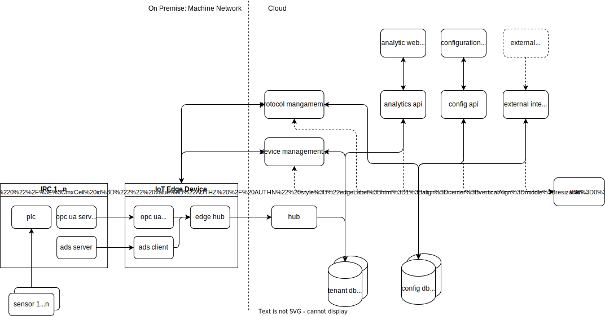
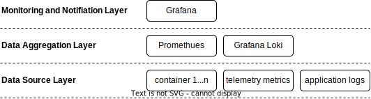
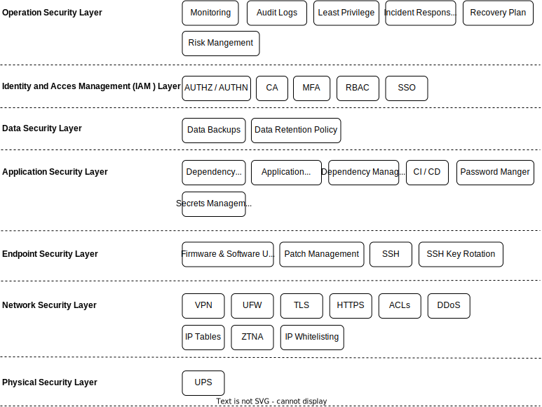
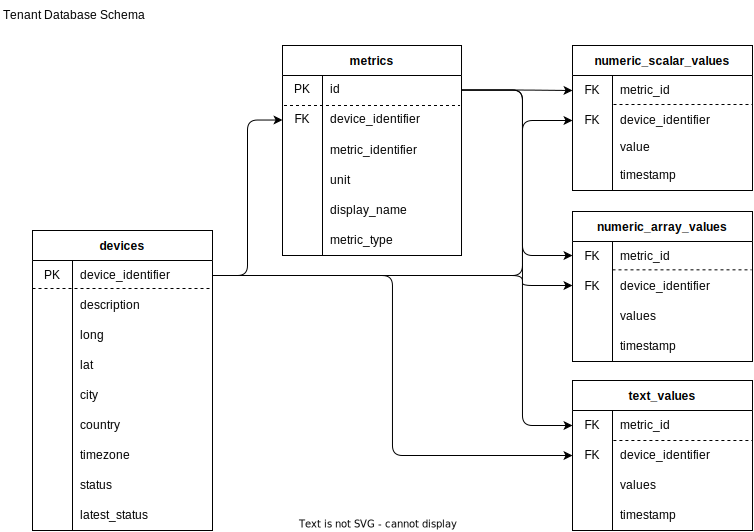

This project aims to develop an Internet of Things (IoT) platform offered as a Software as a Service (SaaS) solution, designed for small to medium-sized businesses (SMBs) in the mechanical engineering sector. The platform provides real-time monitoring and leverages machine learning techniques for anomaly detection and predictive Maintenance.

## Table of contents
- [Table of contents](#table-of-contents)
- [Steps to Setup the Project](#steps-to-setup-the-project)
- [Software Architecture](#software-architecture)
- [Future Architecture](#future-architecture)
- [Monitoring](#monitoring)
- [Security](#security)
- [Device Orchestration \& Deployment](#device-orchestration--deployment)
- [Technology Stack](#technology-stack)
- [Sensor Types](#sensor-types)
- [Metric Router API](#metric-router-api)
- [Device Management API](#device-management-api)
- [Database](#database)
- [Documentation](#documentation)
- [Demonstration Video](#demonstration-video)
- [References](#references)

## [Steps to Setup the Project](wiki/setup.md#steps-to-setup-the-project) 

## Software Architecture

## Future Architecture

## Monitoring

To monitor the components of the IoT platform, Prometheus, Grafana Loki, and Grafana will be utilized. Prometheus will collect metrics from various services and store them in a time-series database. Application logs will be sent to Grafana Loki for centralized logging. Grafana will be used to visualize both metrics and logs, creating dashboards to monitor the system's health and performance.

## Security

In the first phase of the security implementation, the following steps will be carried out:

**Identity and Access Management (IAM) with Keycloak**

Keycloak will be used to manage user identities and access control. This includes authentication, authorization, and managing roles and permissions for different services and users.
TLS Certificates with Let’s Encrypt:

**Let’s Encrypt and Certbot**

Let’s Encrypt will provide SSL/TLS certificates to ensure secure communication over HTTPS. These certificates will encrypt traffic between clients and servers to protect data in transit. 
Certbot, a tool for managing Let's Encrypt certificates, will be set up to automatically renew SSL/TLS certificates before they expire. This ensures uninterrupted secure communication without manual intervention.

**NGINX as a Reverse Proxy**

NGINX will act as a reverse proxy to manage incoming traffic to the backend services. It will handle SSL/TLS termination, ensuring secure HTTPS communication between clients and the proxy.
Additionally, NGINX will provide DDoS protection by limiting and filtering malicious traffic, and enforce HTTPS redirection, ensuring all traffic is secured with encryption.

## Device Orchestration & Deployment
Initially GitLab pipelines will be used to manage the CI/CD process, ensuring automated and streamlined deployments.
Looking ahead, Ansible may be introduced for device orchestration and application deployment, providing more flexibility in managing infrastructure. As the project evolves, tools like Portainer or Helm could also be considered for application deployment, offering container orchestration and Kubernetes management capabilities.

## Technology Stack
- Python
- PostgreSQL with TimescaleDB Extension
- TypeScript 
- React with D3.js
- Prometheus / Grafana (Phase 3)
- KeyCloak (Phase 3)

## [Sensor Types](wiki/sensors_types.md#sensor-types)

## [Metric Router API](wiki/metric_router_api.md#metrics-router-api)

## [Device Management API](wiki/device_mgmt_api.md#device-management-api)

## Database

**Assumtions**
- A tenant can have multiple devices
- A device identifier inside a tenant is unique, although a same device identifier inside a different tenant may be possible.
- A device can have multiple sensors

## Documentation
- [Distributed IoT Platform](docs/distributed_iot_platform.pdf)
- [Machine Learning Techniques for Distributed IoT Platform](/docs/Machine%20Learning%20Techniques%20for%20Distributed%20IoT%20Platform.pdf)

## Demonstration Video
[Machine Learning Techniques for Distributed IoT Platform](/videos/pw2_iot.mp4)

## References
- [OWASP Top 10](https://owasp.org/www-project-top-ten/)
- [HashiCorp Vault](https://github.com/hashicorp/vault)
- [Climate Data](https://www.uea.ac.uk/groups-and-centres/climatic-research-unit/data)

